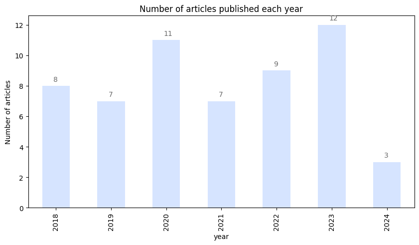
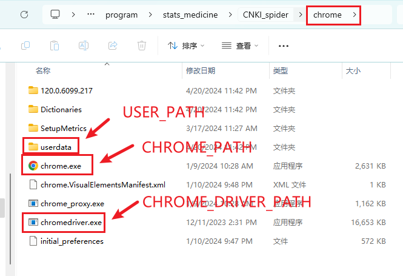

# stats_medical
 Some projects related to medical statistics
 - Stats_python_R
 - CNKI_spider
 - DIC_test
 - K_ion
 - LD50zyy
 
## Stats_python_R
Updated: April 2023

Acknowledgment:
A heartfelt appreciation to Professor Li for his generous sharing of statistical codes.

During this semester's study of medical statistics, not only have I compiled the statistical codes provided by Professor Li, but I have also integrated knowledge from the undergraduate medical statistics course at Fudan University in an effort to expand my understanding in the field of statistics.

Course Overview:

    Course Title: "Python for Statistical and Data Analysis Practical Application"
    Course Link: https://github.com/jinhualee/datashine

Course Highlights:

- Integrates the principles of statistics and data analysis with Python for both theoretical explanation and practical application.
- Covers a wide range of statistical and data analysis models, especially mainstream algorithms such as:
    - Parameter Estimation
    - Hypothesis Testing
    - Linear Regression
    - Generalized Linear Regression
    - Nonlinear Models
    - Lasso (Least Absolute Shrinkage and Selection Operator)
    - Ridge Regression
    - Generalized Additive Models
    - Orthogonal Polynomial Models
    - Regression Splines
- Includes both one-way and two-way ANOVA (Analysis of Variance).
- Commonly used in machine learning:
    - Principal Component Analysis (PCA)
    - Factor Analysis
    - Canonical Correlation Analysis
    - Cluster Analysis
- A variety of non-parametric statistical models, including:
    - Non-parametric Statistical Inference
    - Scale Inference
    - Location Inference
    - Analysis of Contingency Table Data
    - Attribute Data Analysis
    - Log-Linear Models
    - Quantile Regression Models
    - Non-parametric Kernel Density Estimation
    - Non-parametric Regression

# CNKI_spider
 Updated: March 2023
 
CNKI_spider is a Python application designed to automate the retrieval of academic documents from the China National Knowledge Infrastructure (CNKI) and organize the collected data into an Excel spreadsheet. This tool not only simplifies the literature search process but also provides a statistical analysis of the retrieved documents based on their publication years.

### Key Features

- **Automated Literature Search:** Systematically searches for academic papers on CNKI according to user-defined criteria.
- **Excel Output:** Exports search results into a well-organized Excel file for easy reference and further analysis.
- **Year-Wise Statistics:** Includes a feature to count and summarize the number of documents published per year.
- **Data Enrichment:** Retrieves full document details including titles, authors, publication years, and abstracts.

### Prerequisites

- Python 3.x
- chrome.exe 

## DIC_test
Updated December 2023

An animal experiment assignment on DIC(disseminated intravascular coagulation)

The independent two-sample t-test was used to examine the APPT, 
PT and FIB indices in the experimental and control groups.

- PT (Prothrombin Time): mainly reflects the status of the exogenous coagulation pathway and the common coagulation pathway. the activators added to the PT test include tissue factor (TF) and calcium ions (Ca2+), so the prolongation of the PT is usually indicative of a lack of coagulation factors (e.g., VII, X, II, V, I) in the exogenous pathway or the common pathway or a lack of activity.

- APTT (activated partial thromboplastin time): mainly reflects the status of the endogenous coagulation pathway and the common coagulation pathway. activators added to the APTT test include phospholipids (PL) and calcium ions (Ca2+), so prolongation of the APTT is usually indicative of a lack of coagulation factors in the endogenous pathway (e.g., XII, XI, IX, VIII) or of low activity. ..

- TT (prothrombin time): mainly reflects the status of fibrinogen conversion in the common coagulation pathway. thrombin is added directly to the TT assay, so prolongation of the TT usually suggests that the amount or function of fibrinogen is abnormal, or that anti-fibrinogen antibodies are present.

## K_ion
Updated December 2023

Line graph of potassium ion concentration as a function of time

## LD50zyy
Updated November 2023

This R package is used to calculate LD50 with Bliss & Karbor

LD50: Median Lethal Dose,LD50, or The dose that causes half of the deaths 
in a group of experimental animals is a statistically calculated value 
that is often used to express and compare acute toxicity.The smaller the 
LD50 value, the more toxic the exogenous chemical is, and conversely, 
the larger the value, the less toxic it is.

There are many ways to calculate the LD50, 
which requires statistical analysis to obtain the LD50 and 
the 95% confidence limit range. 
Commonly used are the modified Karber method, 
the Horn method and 
the Bliss method.

